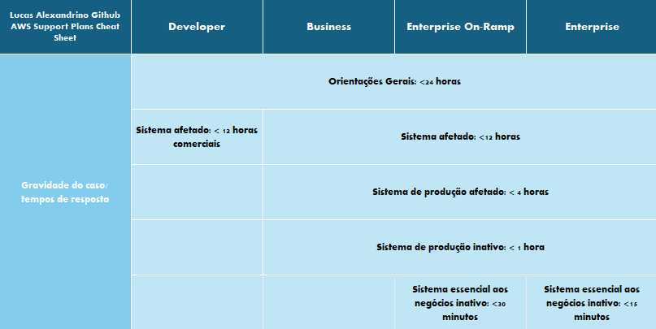
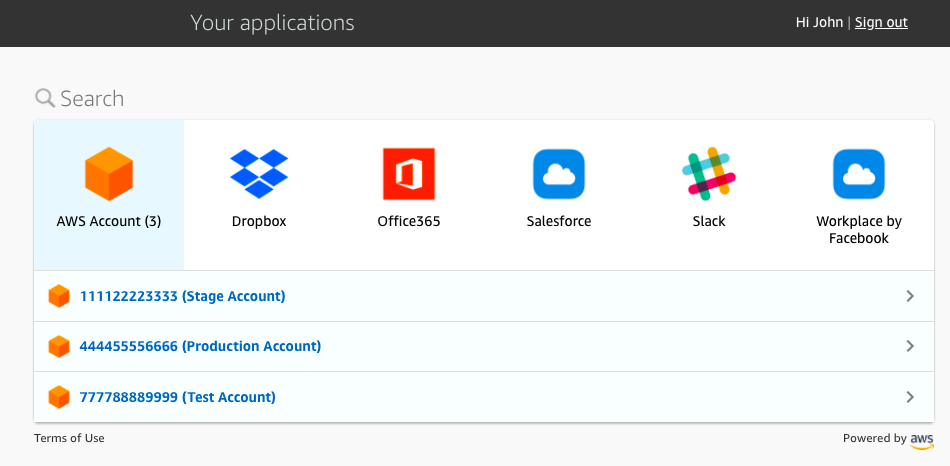
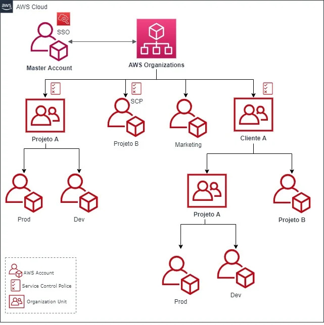

<!--- 

-->
<!--- 

🔴 red: +5V
🟠 orange: +3.3V
⚫ black: ground
⚪ white: ground (pull-down)
🟣 purple: I2C signal
🟢 green: clock signal
🟡 yellow: WS2812 signal
🔵 blue: resistor bridge (analogue) input
-->

# AWS Cloud Practitioner Study Guide

Este repositório contém conteudos e resumos, focados em Cloud computing e AWS, que aprendi durante o estudo para a certificação AWS Cloud Practitioner e outras certificações.

O exame tem os seguintes domínios do conteúdo e ponderações:

- Domínio 1: Conceitos da nuvem (24% do conteúdo pontuado)
- Domínio 2: Segurança e conformidade (30% do contéudo pontuado)
- Domínio 3: Tecnologia e serviços da nuvem (34% do contéudo pontuado)
- Domínio 4: Cobrança, preços e suporte (12% do conteúdo pontuado)

O conteúdo está ***numerado*** de acordo com os domínios da certificação AWS Practitioner, porém ***ordenado*** da melhor maneira para o entendimento.

Contribuições são bem-vindas! Sinta-se à vontade para abrir uma issue ou enviar um pull request com melhorias ou correções.

## 1.Conceitos da nuvem

Computação em nuvem é a entrega sob demanda de poder computacional, armazenamento de banco de dados, aplicativos e outros recursos de TI por meio de uma plataforma de serviços em nuvem via Internet, com precificação <**pay-as-you-go**>.

Essa abordagem oferece uma maneira simples de acessar servidores, armazenamento, bancos de dados e um amplo conjunto de serviços de aplicativos pela Internet.

A AWS possui e mantém o hardware conectado à infraestrutura necessária para executar esses serviços, enquanto você provisiona e utiliza o que precisa por meio de uma aplicação web.

##  1.Vantagens da Nuvem AWS

1. **Custo Reduzido:**
    1. **Troque despesas de capital por despesas variáveis:**
        - Pague apenas pelos recursos de computação que consome, eliminando a necessidade de investir antecipadamente em data centers e servidores.

1. **Escala Global:**
    1. **Torne-se global em minutos:**
        - Implante aplicativos em várias regiões do mundo com facilidade, proporcionando uma melhor experiência para os clientes
        
2. **Performance:**
    1. **Pare de adivinhar a capacidade:**
        - Elimine a adivinhação sobre suas necessidades de capacidade, obtendo acesso flexível e escalável conforme necessário.
        
3. **Velocidade e Agilidade:**
    1. **Aumente a velocidade e a agilidade:**
        - Desenvolva e disponibilize recursos de TI em minutos, proporcionando maior agilidade organizacional.
        
4. **Produtividade:**
    1. **Pare de gastar dinheiro executando e mantendo data centers:**
        - Concentre-se em projetos diferenciais, deixando a infraestrutura para provedores de nuvem como a AWS.
        
5. **Segurança:**
    1. **Seguro:**
        - A AWS utiliza uma abordagem de ponta a ponta para proteger e fortalecer nossa infraestrutura, incluindo medidas físicas, operacionais e de software. Para obter informações, consulte o Centro de Segurança da AWS.
        
6. **Flexibilidade:**
    1. **Flexível:**
        - A AWS permite que você selecione o sistema operacional, a linguagem de programação, a plataforma de aplicativos da web, o banco de dados e outros serviços necessários. Com a AWS, você recebe um ambiente virtual que lhe permite carregar o software e os serviços que o seu aplicativo necessita. Isso facilita o processo de migração para aplicativos existentes enquanto preserva opções para criar novas soluções.

> *Benefícios*:

https://aws.amazon.com/pt/application-hosting/benefits/

## Modelos de Computação em Nuvem

1. **Infraestrutura como Serviço (IaaS):**
    - Contém os componentes básicos da TI em nuvem e, geralmente, dá acesso (virtual ou no hardware dedicado) a recursos de rede e computadores, como também espaço para o armazenamento de dados.
    - Um exemplo comum de IaaS na AWS é o Amazon EC2, do qual você tem acesso virtual a recursos de computação na nuvem.
2. **Plataforma como Serviço (PaaS):**
    - Elimina a necessidade de gerenciar a infraestrutura subjacente, permitindo que você se concentre no desenvolvimento e gerenciamento de aplicativos.
    - Um exemplo comum de PaaS na AWS é o Amazon RDS, do qual você não tem a necessidade de gerenciar a infraestrutura subjacente para iniciar um banco de dados relacional.
3. **Software como Serviço (SaaS):**
    - Não é necessário saber em como o serviço é mantido ou como a infraestrutura subjacente é gerenciada, você só precisa pensar em como usará este tipo específico de software.
    - Um exemplo comum de aplicação do SaaS é o webmail, no qual você pode enviar e receber e-mails sem precisar gerenciar recursos adicionais para o produto de e-mail ou manter os servidores e sistemas operacionais no qual o programa de e-mail está sendo executado.

Exemplo: Zendesk(AWS MarketPlace), Google Sheets, etc.

  
   

## 3.Tipos de implantação na Nuvem

Existem três tipos comuns de implantação em nuvem:

1. **Nuvem Pública:**
    - Totalmente implantada na nuvem, com todas as partes da aplicação em execução na nuvem.
2. **Nuvem Híbrida:**
    - Conecta recursos em nuvem AWS, a recursos existentes fora da nuvem (ambiente on-premises), proporcionando uma integração híbrida entre esses ambientes.
3. **Nuvem Privada (on-premises):**
    - Nuvem gerenciada internamente, usando virtualização e ferramentas de gerenciamento de recursos. Ela pode estar tanto on-premises, quanto em um hardware dedicado em uma provedora de nuvem.

## Planos do AWS Support

Existem 4 planos de suporte AWS:

Developer, Business, Enterprise On-Ramp, Enterprise

(Ler a tabela inteira em:https://aws.amazon.com/pt/premiumsupport/plans/)

### Legenda:

- **Service quotas**(cotas de serviço)**:** Limites impostas via recurso(numero máximo de EC2 em uma região) ou conta (numero máximo de buckets em um s3), existem limites flexíveis(soft limits) e não flexíveis(hard limits)
- **Trusted Advisor**(consultor confiável**)**:Ferramenta da AWS para te ajudar através de conselhos e indicações, como Reduzir custo, Aumentar a performance, Melhorar a Segurança e te indicar Possíveis falhas futuras(Fault tolerance).
- **API do Support**: API utilizada para abrir casos no suporte(Apenas enterprise on-Ramp, ou enterprise)
- **Support automation workflows**: Diagnostico e correção automático a partir de coleções de troubleshooting comuns feitos pela engenharia do suporte.
- **AWS re:Post**: Comunidade(Fórum) da AWS, tendo acessos a conteúdos selecionados e especialistas cloud

## 2.3 IAM

No IAM da AWS, funções, políticas e grupos são todos usados para gerenciar o acesso aos recursos da AWS.

Uma **função** define um conjunto de **políticas de acesso** que determinam quais ações um **usuário ou serviço** da AWS pode realizar. As funções são úteis quando você deseja conceder acesso (temporário) a recursos da AWS a uma entidade de terceiros, como um serviço da AWS ou um usuário fora da sua conta da AWS.

Uma **política**, por outro lado, é um documento em **JSON** que define um conjunto de **permissões** e especifica a quais recursos da AWS essas **permissões** concedem acesso. **As políticas podem ser anexadas a funções**, grupos ou usuários individuais para definir seu **nível de acesso** aos recursos da AWS. As políticas são úteis quando você deseja definir e impor permissões específicas para um recurso ou conjunto de recursos específicos.

Um **grupo** é uma coleção de usuários que compartilham permissões comuns. Os grupos facilitam a gestão de permissões para vários usuários de uma vez, pois as políticas podem ser anexadas a um grupo e aplicadas a todos os usuários dentro desse grupo. Ao atribuir permissões a um grupo, é possível conceder ou revogar o acesso para vários usuários com uma única ação.

De maneira geral, as funções são usadas para conceder acesso a recursos ou serviços específicos, as políticas são usadas para definir as permissões para esses recursos ou serviços, e os grupos são usados para organizar e gerenciar vários usuários com permissões semelhantes.

## **2.3 Funções do IAM com instâncias EC2**

As funções do IAM podem ser usadas para conceder permissões a aplicativos em execução em instâncias EC2 para solicitações de API da AWS usando perfis de instância.

Apenas uma função pode ser atribuída a uma instância EC2 por vez.

Uma função pode ser atribuída no momento da criação da instância EC2 ou a qualquer momento posteriormente.

Crie uma função do IAM com duas políticas:

- Política de permissões – concede ao usuário da função as permissões necessárias em um recurso.
- Política de confiança – especifica as contas confiáveis que têm permissão para assumir a função. Wildcards(todos, no caso usa-se o asterisco (*)) não podem ser especificados como principal. Uma política de permissões também deve ser anexada ao usuário na conta confiável

## 2.3 IAM Identity Center

O **IAM Identity Center** foi desenvolvido com base no AWS **Identity** and Access Management (**IAM**) para simplificar o gerenciamento de **acesso a várias contas da AWS**, **aplicações da AWS** e outras **aplicações de nuvem habilitadas para SAML.**

***IAM:*** Habilita usuários e grupos, para os recursos e serviços da conta que foram criados, **preferencialmente utilizado** de modo programático em uma única conta
***IAM Identity Center:*** Habilita novos usuários e grupos, para terem **acesso a várias contas** AWS, **aplicações da AWS** por exemplo um PaaS ou SaaS, **preferencialmente utilizado** a usuários que precisam de acesso ao **portal**

> Portal de Acesso AWS, contas e serviços

## 4. AWS Organizations

AWS Organizations é uma poderosa ferramenta para gerenciar, organizar e aplicar políticas de segurança em um ambiente multi-conta AWS.

Utilizando OUs e SCPs, é possível manter um controle rigoroso sobre as permissões e garantir conformidade em toda a organização, enquanto aproveita a flexibilidade e a escalabilidade da nuvem AWS.

**Lembre-se para o exame, que:**

- O AWS Organizations é um serviço de gerenciamento de contas, que permite **consolidar várias contas AWS**, **em uma única organização**.
- A grande vantagem de utilizar o AWS Organizations é obter **faturamento consolidado**.

Nesse diagrama do AWS Organizations, é possível ver a Master Account, Unidades Organizacionais (OUs), Contas AWS e políticas de acesso (ServiceControlPolicies).

## 3.2 Definir a infraestrutura global da AWS.

Sua infraestrutura é constituída por Regiões, Zonas de Disponibilidade, Pontos de Presença (também conhecido como locais de borda) e zonas locais

Uma **Região da AWS** é uma localização física no mundo, é completamente independente e contém várias zonas de disponibilidade.

Uma **Zona de Disponibilidade** consistem em um ou mais data centers discretos, cada um com energia redundante, rede, alojados em instalações separadas e conectados com links de baixa latência

Os **Pontos de Presença(Locais de borda)** são uma infraestrutura de servidores alocados distantes de regiões da AWS, e servem como **cache de informações dos dados de usuários,** para acelerar a entrega de conteúdo para usuários distantes.

E as **Zonas Locais** são um tipo de **implantação de infraestrutura da AWS** que oferecem baixa latência em algum ponto geográfico, sendo geralmente associado em alguma cidade , permitindo aplicações com requisitos de latência inferior a 10 milissegundos aos usuários, devido ter uma **conexão de rede privada direta**, com uma AZ da AWS.

> *Resumo:*
> 
- ***Edge Locations (Pontos de Presença):** Ideais para distribuição de conteúdo estático e dinâmico, aceleração de sites, APIs, e melhoria de desempenho global e segurança.*
- ***Local Zones (Zonas Locais):** Melhor utilizadas para aplicativos sensíveis à latência, que precisam de recursos computacionais próximos aos usuários, ou para garantir conformidade e desempenho específicos de uma região.*

AZ’s(Availability Zone)

- Você mantém controle completo e propriedade sobre a região na qual seus dados estão fisicamente localizados, facilitando o atendimento aos requisitos regionais de conformidade e residência de dados.
- Observe que há uma taxa para transferência de dados entre regiões.
- Cada Zona de Disponibilidade é projetada como uma zona de falha independente.
- Se distribuir suas instâncias EC2 em várias Zonas de Disponibilidade e uma instância falhar, você pode projetar sua aplicação para que uma instância em outra Zona de Disponibilidade possa lidar com as solicitações.

Para garantir que os recursos sejam distribuídos entre as Zonas de Disponibilidade de uma região, a AWS mapeia independentemente as Zonas de Disponibilidade para nomes de cada conta da AWS.

Por exemplo, a Zona de Disponibilidade us-east-1a para sua conta da AWS pode não ser a mesma localização que us-east-1a para outra conta da AWS.

Para coordenar as zonas de disponibilidade entre contas, use o *ID da AZ* que é um identificador exclusivo e consistente para uma zona de disponibilidade.Por exemplo,`use1-az2` é uma ID AZ para a `us-east-1` região e tem a mesma localização em todas as AWS contas.
