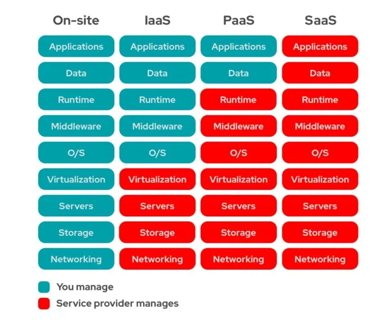
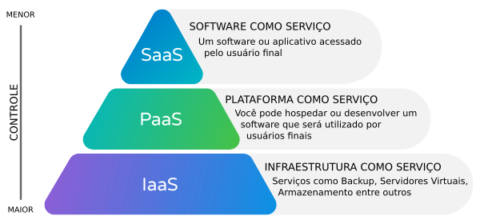
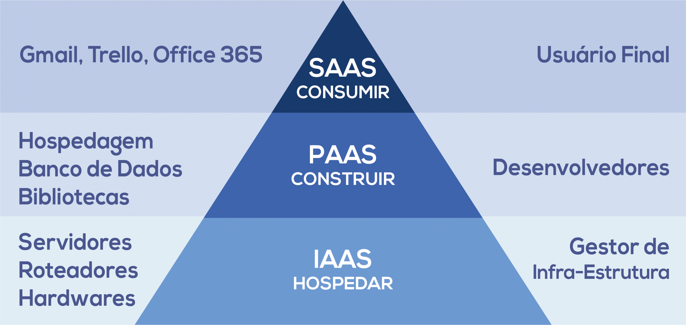

# AWS Cloud Practitioner Study Guide

Este repositório contém conteudos e resumos, focados em Cloud computing e AWS, que aprendi durante o estudo para a certificação AWS Cloud Practitioner e outras certificações.

O exame tem os seguintes domínios do conteúdo e ponderações:

- Domínio 1: Conceitos da nuvem (24% do conteúdo pontuado)
- Domínio 2: Segurança e conformidade (30% do contéudo pontuado)
- Domínio 3: Tecnologia e serviços da nuvem (34% do contéudo pontuado)
- Domínio 4: Cobrança, preços e suporte (12% do conteúdo pontuado)

O conteúdo está ***numerado*** de acordo com os domínios da certificação AWS Practitioner, porém ***ordenado*** da melhor maneira para o entendimento.

Contribuições são bem-vindas! Sinta-se à vontade para abrir uma issue ou enviar um pull request com melhorias ou correções.

## 1.Conceitos da nuvem

Computação em nuvem é a entrega sob demanda de poder computacional, armazenamento de banco de dados, aplicativos e outros recursos de TI por meio de uma plataforma de serviços em nuvem via Internet, com precificação <**pay-as-you-go**>.

Essa abordagem oferece uma maneira simples de acessar servidores, armazenamento, bancos de dados e um amplo conjunto de serviços de aplicativos pela Internet.

A AWS possui e mantém o hardware conectado à infraestrutura necessária para executar esses serviços, enquanto você provisiona e utiliza o que precisa por meio de uma aplicação web.

##  1.Vantagens da Nuvem AWS

1. **Custo Reduzido:**
    1. **Troque despesas de capital por despesas variáveis:**
        - Pague apenas pelos recursos de computação que consome, eliminando a necessidade de investir antecipadamente em data centers e servidores.

1. **Escala Global:**
    1. **Torne-se global em minutos:**
        - Implante aplicativos em várias regiões do mundo com facilidade, proporcionando uma melhor experiência para os clientes
        
2. **Performance:**
    1. **Pare de adivinhar a capacidade:**
        - Elimine a adivinhação sobre suas necessidades de capacidade, obtendo acesso flexível e escalável conforme necessário.
        
3. **Velocidade e Agilidade:**
    1. **Aumente a velocidade e a agilidade:**
        - Desenvolva e disponibilize recursos de TI em minutos, proporcionando maior agilidade organizacional.
        
4. **Produtividade:**
    1. **Pare de gastar dinheiro executando e mantendo data centers:**
        - Concentre-se em projetos diferenciais, deixando a infraestrutura para provedores de nuvem como a AWS.
        
5. **Segurança:**
    1. **Seguro:**
        - A AWS utiliza uma abordagem de ponta a ponta para proteger e fortalecer nossa infraestrutura, incluindo medidas físicas, operacionais e de software. Para obter informações, consulte o Centro de Segurança da AWS.
        
6. **Flexibilidade:**
    1. **Flexível:**
        - A AWS permite que você selecione o sistema operacional, a linguagem de programação, a plataforma de aplicativos da web, o banco de dados e outros serviços necessários. Com a AWS, você recebe um ambiente virtual que lhe permite carregar o software e os serviços que o seu aplicativo necessita. Isso facilita o processo de migração para aplicativos existentes enquanto preserva opções para criar novas soluções.

> *Benefícios*:

https://aws.amazon.com/pt/application-hosting/benefits/

## Modelos de Computação em Nuvem

1. **Infraestrutura como Serviço (IaaS):**
    - Contém os componentes básicos da TI em nuvem e, geralmente, dá acesso (virtual ou no hardware dedicado) a recursos de rede e computadores, como também espaço para o armazenamento de dados.
    - Um exemplo comum de IaaS na AWS é o Amazon EC2, do qual você tem acesso virtual a recursos de computação na nuvem.
2. **Plataforma como Serviço (PaaS):**
    - Elimina a necessidade de gerenciar a infraestrutura subjacente, permitindo que você se concentre no desenvolvimento e gerenciamento de aplicativos.
    - Um exemplo comum de PaaS na AWS é o Amazon RDS, do qual você não tem a necessidade de gerenciar a infraestrutura subjacente para iniciar um banco de dados relacional.
3. **Software como Serviço (SaaS):**
    - Não é necessário saber em como o serviço é mantido ou como a infraestrutura subjacente é gerenciada, você só precisa pensar em como usará este tipo específico de software.
    - Um exemplo comum de aplicação do SaaS é o webmail, no qual você pode enviar e receber e-mails sem precisar gerenciar recursos adicionais para o produto de e-mail ou manter os servidores e sistemas operacionais no qual o programa de e-mail está sendo executado.

Exemplo: Zendesk(AWS MarketPlace), Google Sheets, etc.

|  | |

## 3.Tipos de implantação na Nuvem

Existem três tipos comuns de implantação em nuvem:

1. **Nuvem Pública:**
    - Totalmente implantada na nuvem, com todas as partes da aplicação em execução na nuvem.
2. **Nuvem Híbrida:**
    - Conecta recursos em nuvem AWS, a recursos existentes fora da nuvem (ambiente on-premises), proporcionando uma integração híbrida entre esses ambientes.
3. **Nuvem Privada (on-premises):**
    - Nuvem gerenciada internamente, usando virtualização e ferramentas de gerenciamento de recursos. Ela pode estar tanto on-premises, quanto em um hardware dedicado em uma provedora de nuvem.
