<!--- 

-->
<!--- 

🔴 red: +5V
🟠 orange: +3.3V
⚫ black: ground
⚪ white: ground (pull-down)
🟣 purple: I2C signal
🟢 green: clock signal
🟡 yellow: WS2812 signal
🔵 blue: resistor bridge (analogue) input
-->

# AWS Cloud Practitioner Study Guide

Este repositório contém conteudos e resumos, focados em Cloud computing e AWS, que aprendi durante o estudo para a certificação AWS Cloud Practitioner e outras certificações.

O exame tem os seguintes domínios do conteúdo e ponderações:

- Domínio 1: Conceitos da nuvem (24% do conteúdo pontuado)
- Domínio 2: Segurança e conformidade (30% do contéudo pontuado)
- Domínio 3: Tecnologia e serviços da nuvem (34% do contéudo pontuado)
- Domínio 4: Cobrança, preços e suporte (12% do conteúdo pontuado)

O conteúdo está ***numerado*** de acordo com os domínios da certificação AWS Practitioner, porém ***ordenado*** da melhor maneira para o entendimento.

Contribuições são bem-vindas! Sinta-se à vontade para abrir uma issue ou enviar um pull request com melhorias ou correções.

## 1.Conceitos da nuvem

Computação em nuvem é a entrega sob demanda de poder computacional, armazenamento de banco de dados, aplicativos e outros recursos de TI por meio de uma plataforma de serviços em nuvem via Internet, com precificação <**pay-as-you-go**>.

Essa abordagem oferece uma maneira simples de acessar servidores, armazenamento, bancos de dados e um amplo conjunto de serviços de aplicativos pela Internet.

A AWS possui e mantém o hardware conectado à infraestrutura necessária para executar esses serviços, enquanto você provisiona e utiliza o que precisa por meio de uma aplicação web.

##  1.Vantagens da Nuvem AWS

1. **Custo Reduzido:**
    1. **Troque despesas de capital por despesas variáveis:**
        - Pague apenas pelos recursos de computação que consome, eliminando a necessidade de investir antecipadamente em data centers e servidores.

1. **Escala Global:**
    1. **Torne-se global em minutos:**
        - Implante aplicativos em várias regiões do mundo com facilidade, proporcionando uma melhor experiência para os clientes
        
2. **Performance:**
    1. **Pare de adivinhar a capacidade:**
        - Elimine a adivinhação sobre suas necessidades de capacidade, obtendo acesso flexível e escalável conforme necessário.
        
3. **Velocidade e Agilidade:**
    1. **Aumente a velocidade e a agilidade:**
        - Desenvolva e disponibilize recursos de TI em minutos, proporcionando maior agilidade organizacional.
        
4. **Produtividade:**
    1. **Pare de gastar dinheiro executando e mantendo data centers:**
        - Concentre-se em projetos diferenciais, deixando a infraestrutura para provedores de nuvem como a AWS.
        
5. **Segurança:**
    1. **Seguro:**
        - A AWS utiliza uma abordagem de ponta a ponta para proteger e fortalecer nossa infraestrutura, incluindo medidas físicas, operacionais e de software. Para obter informações, consulte o Centro de Segurança da AWS.
        
6. **Flexibilidade:**
    1. **Flexível:**
        - A AWS permite que você selecione o sistema operacional, a linguagem de programação, a plataforma de aplicativos da web, o banco de dados e outros serviços necessários. Com a AWS, você recebe um ambiente virtual que lhe permite carregar o software e os serviços que o seu aplicativo necessita. Isso facilita o processo de migração para aplicativos existentes enquanto preserva opções para criar novas soluções.

> *Benefícios*:

https://aws.amazon.com/pt/application-hosting/benefits/

## Modelos de Computação em Nuvem

1. **Infraestrutura como Serviço (IaaS):**
    - Contém os componentes básicos da TI em nuvem e, geralmente, dá acesso (virtual ou no hardware dedicado) a recursos de rede e computadores, como também espaço para o armazenamento de dados.
    - Um exemplo comum de IaaS na AWS é o Amazon EC2, do qual você tem acesso virtual a recursos de computação na nuvem.
2. **Plataforma como Serviço (PaaS):**
    - Elimina a necessidade de gerenciar a infraestrutura subjacente, permitindo que você se concentre no desenvolvimento e gerenciamento de aplicativos.
    - Um exemplo comum de PaaS na AWS é o Amazon RDS, do qual você não tem a necessidade de gerenciar a infraestrutura subjacente para iniciar um banco de dados relacional.
3. **Software como Serviço (SaaS):**
    - Não é necessário saber em como o serviço é mantido ou como a infraestrutura subjacente é gerenciada, você só precisa pensar em como usará este tipo específico de software.
    - Um exemplo comum de aplicação do SaaS é o webmail, no qual você pode enviar e receber e-mails sem precisar gerenciar recursos adicionais para o produto de e-mail ou manter os servidores e sistemas operacionais no qual o programa de e-mail está sendo executado.

Exemplo: Zendesk(AWS MarketPlace), Google Sheets, etc.

  
   

## 3.Tipos de implantação na Nuvem

Existem três tipos comuns de implantação em nuvem:

1. **Nuvem Pública:**
    - Totalmente implantada na nuvem, com todas as partes da aplicação em execução na nuvem.
2. **Nuvem Híbrida:**
    - Conecta recursos em nuvem AWS, a recursos existentes fora da nuvem (ambiente on-premises), proporcionando uma integração híbrida entre esses ambientes.
3. **Nuvem Privada (on-premises):**
    - Nuvem gerenciada internamente, usando virtualização e ferramentas de gerenciamento de recursos. Ela pode estar tanto on-premises, quanto em um hardware dedicado em uma provedora de nuvem.

## Planos do AWS Support

Existem 4 planos de suporte AWS:

Developer, Business, Enterprise On-Ramp, Enterprise

(Ler a tabela inteira em:https://aws.amazon.com/pt/premiumsupport/plans/)

### Legenda:

- **Service quotas**(cotas de serviço)**:** Limites impostas via recurso(numero máximo de EC2 em uma região) ou conta (numero máximo de buckets em um s3), existem limites flexíveis(soft limits) e não flexíveis(hard limits)
- **Trusted Advisor**(consultor confiável**)**:Ferramenta da AWS para te ajudar através de conselhos e indicações, como Reduzir custo, Aumentar a performance, Melhorar a Segurança e te indicar Possíveis falhas futuras(Fault tolerance).
- **API do Support**: API utilizada para abrir casos no suporte(Apenas enterprise on-Ramp, ou enterprise)
- **Support automation workflows**: Diagnostico e correção automático a partir de coleções de troubleshooting comuns feitos pela engenharia do suporte.
- **AWS re:Post**: Comunidade(Fórum) da AWS, tendo acessos a conteúdos selecionados e especialistas cloud

## 2.3 IAM

No IAM da AWS, funções, políticas e grupos são todos usados para gerenciar o acesso aos recursos da AWS.

Uma **função** define um conjunto de **políticas de acesso** que determinam quais ações um **usuário ou serviço** da AWS pode realizar. As funções são úteis quando você deseja conceder acesso (temporário) a recursos da AWS a uma entidade de terceiros, como um serviço da AWS ou um usuário fora da sua conta da AWS.

Uma **política**, por outro lado, é um documento em **JSON** que define um conjunto de **permissões** e especifica a quais recursos da AWS essas **permissões** concedem acesso. **As políticas podem ser anexadas a funções**, grupos ou usuários individuais para definir seu **nível de acesso** aos recursos da AWS. As políticas são úteis quando você deseja definir e impor permissões específicas para um recurso ou conjunto de recursos específicos.

Um **grupo** é uma coleção de usuários que compartilham permissões comuns. Os grupos facilitam a gestão de permissões para vários usuários de uma vez, pois as políticas podem ser anexadas a um grupo e aplicadas a todos os usuários dentro desse grupo. Ao atribuir permissões a um grupo, é possível conceder ou revogar o acesso para vários usuários com uma única ação.

De maneira geral, as funções são usadas para conceder acesso a recursos ou serviços específicos, as políticas são usadas para definir as permissões para esses recursos ou serviços, e os grupos são usados para organizar e gerenciar vários usuários com permissões semelhantes.

## **2.3 Funções do IAM com instâncias EC2**

As funções do IAM podem ser usadas para conceder permissões a aplicativos em execução em instâncias EC2 para solicitações de API da AWS usando perfis de instância.

Apenas uma função pode ser atribuída a uma instância EC2 por vez.

Uma função pode ser atribuída no momento da criação da instância EC2 ou a qualquer momento posteriormente.

Crie uma função do IAM com duas políticas:

- Política de permissões – concede ao usuário da função as permissões necessárias em um recurso.
- Política de confiança – especifica as contas confiáveis que têm permissão para assumir a função. Wildcards(todos, no caso usa-se o asterisco (*)) não podem ser especificados como principal. Uma política de permissões também deve ser anexada ao usuário na conta confiável

## 2.3 IAM Identity Center

O **IAM Identity Center** foi desenvolvido com base no AWS **Identity** and Access Management (**IAM**) para simplificar o gerenciamento de **acesso a várias contas da AWS**, **aplicações da AWS** e outras **aplicações de nuvem habilitadas para SAML.**

***IAM:*** Habilita usuários e grupos, para os recursos e serviços da conta que foram criados, **preferencialmente utilizado** de modo programático em uma única conta
***IAM Identity Center:*** Habilita novos usuários e grupos, para terem **acesso a várias contas** AWS, **aplicações da AWS** por exemplo um PaaS ou SaaS, **preferencialmente utilizado** a usuários que precisam de acesso ao **portal**

> Portal de Acesso AWS, contas e serviços

## 4. AWS Organizations

AWS Organizations é uma poderosa ferramenta para gerenciar, organizar e aplicar políticas de segurança em um ambiente multi-conta AWS.

Utilizando OUs e SCPs, é possível manter um controle rigoroso sobre as permissões e garantir conformidade em toda a organização, enquanto aproveita a flexibilidade e a escalabilidade da nuvem AWS.

**Lembre-se para o exame, que:**

- O AWS Organizations é um serviço de gerenciamento de contas, que permite **consolidar várias contas AWS**, **em uma única organização**.
- A grande vantagem de utilizar o AWS Organizations é obter **faturamento consolidado**.

Nesse diagrama do AWS Organizations, é possível ver a Master Account, Unidades Organizacionais (OUs), Contas AWS e políticas de acesso (ServiceControlPolicies).

## 3.2 Definir a infraestrutura global da AWS.

Sua infraestrutura é constituída por Regiões, Zonas de Disponibilidade, Pontos de Presença (também conhecido como locais de borda) e zonas locais

Uma **Região da AWS** é uma localização física no mundo, é completamente independente e contém várias zonas de disponibilidade.

Uma **Zona de Disponibilidade** consistem em um ou mais data centers discretos, cada um com energia redundante, rede, alojados em instalações separadas e conectados com links de baixa latência

Os **Pontos de Presença(Locais de borda)** são uma infraestrutura de servidores alocados distantes de regiões da AWS, e servem como **cache de informações dos dados de usuários,** para acelerar a entrega de conteúdo para usuários distantes.

E as **Zonas Locais** são um tipo de **implantação de infraestrutura da AWS** que oferecem baixa latência em algum ponto geográfico, sendo geralmente associado em alguma cidade , permitindo aplicações com requisitos de latência inferior a 10 milissegundos aos usuários, devido ter uma **conexão de rede privada direta**, com uma AZ da AWS.

> *Resumo:*
> 
- ***Edge Locations (Pontos de Presença):** Ideais para distribuição de conteúdo estático e dinâmico, aceleração de sites, APIs, e melhoria de desempenho global e segurança.*
- ***Local Zones (Zonas Locais):** Melhor utilizadas para aplicativos sensíveis à latência, que precisam de recursos computacionais próximos aos usuários, ou para garantir conformidade e desempenho específicos de uma região.*

AZ’s(Availability Zone)

- Você mantém controle completo e propriedade sobre a região na qual seus dados estão fisicamente localizados, facilitando o atendimento aos requisitos regionais de conformidade e residência de dados.
- Observe que há uma taxa para transferência de dados entre regiões.
- Cada Zona de Disponibilidade é projetada como uma zona de falha independente.
- Se distribuir suas instâncias EC2 em várias Zonas de Disponibilidade e uma instância falhar, você pode projetar sua aplicação para que uma instância em outra Zona de Disponibilidade possa lidar com as solicitações.

Para garantir que os recursos sejam distribuídos entre as Zonas de Disponibilidade de uma região, a AWS mapeia independentemente as Zonas de Disponibilidade para nomes de cada conta da AWS.

Por exemplo, a Zona de Disponibilidade us-east-1a para sua conta da AWS pode não ser a mesma localização que us-east-1a para outra conta da AWS.

Para coordenar as zonas de disponibilidade entre contas, use o *ID da AZ* que é um identificador exclusivo e consistente para uma zona de disponibilidade.Por exemplo,`use1-az2` é uma ID AZ para a `us-east-1` região e tem a mesma localização em todas as AWS contas.

### CloudFront

## 2.1 Modelo de responsabilidade compartilhada da AWS

O modelo de responsabilidade compartilhada da AWS define o que você (como titular/usuário de uma conta AWS) e a AWS são responsáveis no que diz respeito à segurança e conformidade.

- Responsabilidade da AWS: “segurança DA nuvem”: a AWS é responsável por proteger a infraestrutura que executa todos os serviços oferecidos na Nuvem AWS. Essa infraestrutura é composta por hardware, software, redes e instalações que executam os Serviços de nuvem AWS.
- Responsabilidade do cliente: “segurança NA nuvem”: a responsabilidade do cliente será determinada pelos Serviços de nuvem AWS selecionados por ele.

## 3.3 EC2

O Amazon Elastic Compute Cloud (Amazon EC2) é um serviço de **virtualização** na nuvem da AWS, sendo um dos principais serviços da AWS.

### Hypervisor

Um hipervisor é um hardware, software ou firmware que cria e gerencia máquinas virtuais e aloca recursos a elas.

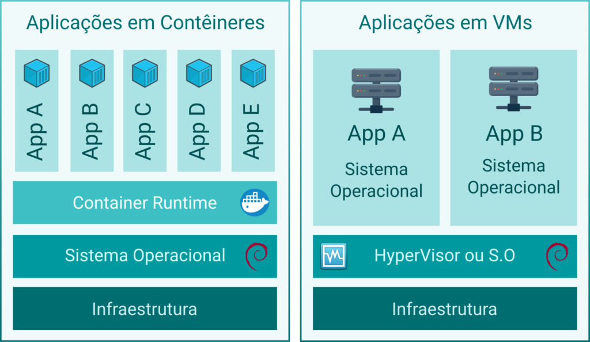

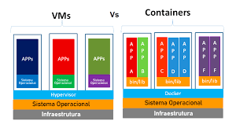

### Tipos de instância do Amazon EC2

**Nomenclatura para classificação de instâncias** 

- **Instâncias de Uso Geral (A, T, M)**
- **Instâncias Otimizadas para Computação (C)**
- **Instâncias Otimizadas para Memória (R, X, U, Z)**
- **Instâncias Otimizadas para Armazenamento (D, I, H)**
    - Começam com I(IOPS) e D

### Modelos de preço EC2

- **On Demand**
    - As instâncias sob demanda permitem que você pague pela capacidade computacional **por hora ou segundo**, sem nenhum compromisso de longo prazo.
- **Reserva de capacidade sob demanda**
    - Permitem que você reserve capacidade de computação para suas instâncias do EC2 em uma zona de disponibilidade específica por **qualquer duração**. As reservas de capacidade reduzem o risco de não conseguir obter capacidade sob demanda em caso de restrições de capacidade e garantem que você sempre tenha acesso à capacidade do EC2 quando precisar.
- **Spot**
    - Instâncias EC2 menos estáveis, ofertadas com base na **oferta e demanda**, quando sua solicitação Spot for atendida, suas Instâncias Spot serão lançadas no preço Spot atual, não excedendo o preço On Demand.
- **Dedicated**
    - Hardware físico dedicado especificamente para sua aplicação, utilizado por empresas que por questões de conformidade e regulação, necessitem de ter um hardware único e não compartilhado, para armazenamento de dados (Financeiro/Governos)
- **Saving Plans**
    - Menor custo que On Demand, pelo compromisso com uma quantidade consistente de uso (medida em $/hora) por um período de 1 ou 3 anos. Existem 3 tipos de Saving Plans
        - **Compute Savings Plans**
            - Os Compute Savings Plans fornecem a **maior flexibilidade**. Esses planos se aplicam automaticamente ao uso da instância do EC2, **independentemente de família de instâncias**, tamanho, AZ, região, sistema operacional ou locação da instância, e também se aplicam ao uso do **Fargate ou Lambda**.
        - **EC2 Instance Savings Plans**
            - Os EC2 Instance Savings Plans fornecem os preços mais baixos em troca do comprometimento com o uso de **famílias de instâncias** individuais em uma região (por exemplo, usar M5 no Norte da Virginia). Isso reduz automaticamente seu custo na **família de instâncias selecionadas nessa região**, qualquer que seja a AZ, o tamanho, o sistema operacional ou a locação.
        - **Amazon SageMaker Savings Plans**
            - O mesmo do Compute Savings Plans, porém para uso de instâncias tipos ML(Machine Learning)

## 2.4 Security Groups e ACLs(Firewalls)

As **Listas de Controle de Acesso à Rede (ACLs)** fornecem uma camada de firewall/segurança no nível de sub-rede.

Os **Security Groups** fornecem uma camada de firewall/segurança no nível de instância.

A tabela abaixo descreve algumas diferenças entre **Security Groups** e **Network ACLs**:

| **GRUPOS DE SEGURANÇA** | **LISTA DE CONTROLE DE ACESSO À REDE (NACLs)** |
| ---                     | ---                                            |
| Aplica-se a **uma** **instância** apenas se associada a um grupo | Aplica-se automaticamente a **todas as instâncias**                                                       |nas sub-redes com as quais está associada 
| Opera no nível de **instância** (interface)                      | Opera no nível de sub-rede 
| Avalia todas as regras                                           | Processa as regras na ordem 
| **Stateful** (se foi permitido entrar, é permitido sair)         | **Stateless** (precisa de uma regra de entrada/saida)
| Suporta apenas **regras de permissão**                           | Suporta **regras de permissão e negação** 

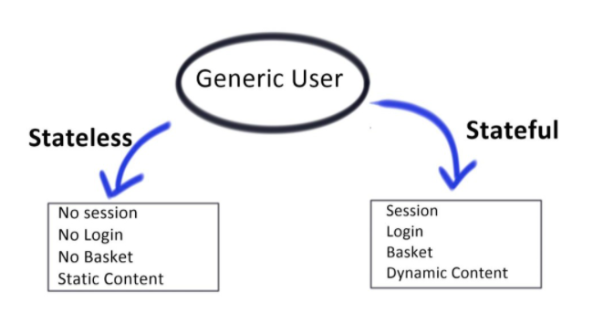

## 3.6 Serviços de armazenamento da AWS

O Amazon Elastic Block Store (EBS) é um serviço de armazenamento de alto desempenho oferecido pela AWS para uso com Amazon Elastic Compute Cloud (EC2). Ele foi projetado para aplicativos que exigem armazenamento de baixa latência para ler e escrever dados em blocos.

Aqui estão algumas características principais do EBS:

1. **Desempenho de Armazenamento**: EBS fornece armazenamento em bloco de alto desempenho que pode ser anexado a uma instância EC2. Os volumes EBS são otimizados para cargas de trabalho que exigem operações de E/S de baixa latência, como bancos de dados e aplicativos que exigem muita E/S.
2. **Durabilidade**: O EBS é projetado para durabilidade. **Os volumes EBS são automaticamente replicados em sua zona de disponibilidade** para proteger contra falhas de componentes, proporcionando alta disponibilidade e durabilidade.
3. **Tipos de Volume**: EBS oferece vários tipos de volume para atender às necessidades de armazenamento e desempenho. Isso inclui os volumes SSD-backed para cargas de trabalho transacionais de uso geral **(gp2 e gp3)** e de alto desempenho **(io1 e io2)**, e os volumes HDD-backed para cargas de trabalho throughput intensivas **(st1 e sc1)**.
4. **Backup com Snapshots**: O EBS oferece a capacidade de criar **snapshots (cópias)** dos seus volumes, que são armazenados no **Amazon S3** para durabilidade. Esses snapshots podem ser usados para criar novos volumes EBS ou para aumentar o tamanho do volume.
5. **Criptografia**: O EBS oferece a opção de criar volumes criptografados e controlar as chaves de criptografia usando o AWS Key Management Service (KMS). Isso ajuda a atender aos requisitos de conformidade e segurança.
6. **Integração com a AWS**: EBS é profundamente integrado com outros serviços da AWS, como Amazon CloudWatch para monitoramento, AWS Identity and Access Management (IAM) para controle de acesso, e AWS Snapshot Scheduler para automação de backup.

Em resumo, o Amazon EBS é uma solução de armazenamento em bloco de alto desempenho que é fundamental para muitas aplicações em execução na AWS devido à sua durabilidade, flexibilidade e integração com a AWS.

### Armazenamento de instância (Instance store)

- Os volumes da store de instâncias são **discos locais** de alta performance **fisicamente** conectados ao computador host em que uma instância EC2 é executada.
- As stores de instâncias são efêmeras, o que significa que os dados são perdidos quando desligados (não persistentes).
- As stores de instâncias são ideais para o armazenamento temporário de informações que mudam com frequência, como buffers, caches ou dados temporários.
- Os volumes da store de instâncias raiz são criados a partir de modelos de AMI armazenados no S3.
- Os volumes da store de instâncias não podem ser destacados/reattached.

## Amazon EFS e FSX

O **Amazon Elastic File System (EFS)** é um serviço de armazenamento de arquivos totalmente gerenciado que facilita a configuração e o dimensionamento de sistemas de arquivos em nuvem na AWS. O EFS foi projetado para ser altamente disponível, durável e seguro, e pode ser usado com uma ampla gama de serviços da AWS e aplicações on-premise.

Aqui estão alguns pontos-chave sobre o Amazon EFS:

1. **Escalabilidade**: O EFS é projetado para escalar automaticamente para acomodar o crescimento dos dados, de alguns gigabytes a petabytes, sem a necessidade de provisionar o armazenamento.
2. **Alta Disponibilidade e Durabilidade**: O EFS armazena automaticamente os arquivos em vários dispositivos dentro e entre várias zonas de disponibilidade para garantir a disponibilidade e durabilidade dos dados.
3. **Compartilhamento de Arquivos**: O EFS suporta o compartilhamento de arquivos entre várias instâncias do Amazon EC2, permitindo que múltiplos servidores acessem um sistema de arquivos simultaneamente.
4. **Integração com AWS**: O EFS pode ser integrado a outros serviços da AWS, como o AWS Backup para backups automatizados e o AWS IAM para controle de acesso.
5. **Tipos de armazenamento**: O EFS oferece várias classes de armazenamento, incluindo Standard e Infrequent Access (IA), permitindo que você otimize os custos com base em seus padrões de acesso aos arquivos.
6. **Segurança**: O EFS inclui suporte para criptografia de dados em repouso e em trânsito, bem como integração com o AWS Key Management Service (KMS) para gerenciamento de chaves de criptografia.

Resumindo, o Amazon EFS é uma solução de armazenamento de arquivos escalável, de alta disponibilidade e segura, que facilita o compartilhamento de arquivos entre instâncias EC2 e outros serviços AWS.

O **Amazon FSx** é um serviço de armazenamento de arquivos totalmente gerenciado da AWS que facilita o lançamento e a execução de sistemas de arquivos de terceiros. O FSx fornece o rico conjunto de recursos e a rápida performance que esses tipos de aplicativos precisam, e atualmente suporta dois sistemas de arquivos: **Windows File Server** para aplicações baseadas em Windows, e **Lustre** para cargas de trabalho de computação intensiva.

Aqui estão alguns pontos chave sobre o Amazon FSx:

1. **FSx para Windows File Server**: Ele fornece um sistema de arquivos nativamente compatível com o Windows, permitindo que você mova com facilidade as aplicações baseadas em Windows que exigem o sistema de arquivos do Windows para a AWS. É construído sobre o Windows Server e oferece suporte a recursos como de duplicação de dados, criptografia de dados em repouso, e acesso via SMB (Server Message Block) e NFS (Network File System).
2. **FSx para Lustre**: O Lustre é um sistema de arquivos popular para cargas de trabalho de computação intensiva, como análise de big data, modelagem de machine learning e processamento de mídia. O FSx para Lustre é totalmente gerenciado pela AWS, simplificando o processo de criação e execução de um sistema de arquivos Lustre.
3. **Desempenho**: O Amazon FSx foi projetado para oferecer o desempenho rápido necessário para suportar aplicações exigentes. Ele fornece baixa latência e altas taxas de transferência de dados.
4. **Compatibilidade e Integração**: O Amazon FSx é totalmente compatível com os sistemas de arquivos que suporta, o que significa que você pode usar suas ferramentas e aplicações existentes sem modificação. Além disso, o FSx se integra com uma série de outros serviços AWS para coisas como backup, monitoramento e acesso seguro a arquivos.
5. **Segurança**: O Amazon FSx oferece várias funcionalidades de segurança, como a capacidade de armazenar dados em redes virtuais privadas da Amazon (VPCs), suporte a redes de acesso (ACLs) para o Windows File Server, criptografia de dados em repouso e em trânsito, e integração com AWS Key Management Service (KMS) para gerenciamento de chaves de criptografia.

Em resumo, o Amazon FSx é um serviço poderoso e flexível que torna mais fácil do que nunca para você executar sistemas de arquivos totalmente gerenciados na AWS. Ele suporta sistemas de arquivos Windows e Lustre, oferecendo um alto nível de desempenho, segurança e integração com outros serviços AWS.

- **IMPORTANTE!**
    
    EFS é para Linux, FSx para Windows

## Amazon S3

O Amazon S3 é um armazenamento de objetos projetado para armazenar e recuperar qualquer quantidade de dados de qualquer lugar – sites e aplicativos móveis, aplicativos corporativos e **dados de sensores ou dispositivos IoT**.

- Você pode armazenar qualquer tipo de arquivo no S3.
- Os arquivos podem ter de 0 bytes a 5 TB.
- Não há limite de armazenamento disponível.
- Os arquivos são armazenados em buckets e são chamados de objetos.
- Buckets são pastas de nível raiz.
- Qualquer subpasta em um bucket, é conhecida como “pasta”.
- O S3 é um namespace universal, então os nomes de buckets devem ser exclusivos globalmente.
- Ao criar um bucket, você precisa selecionar a região onde ele será criado.

**Atenção**: Enquanto o Amazon S3 é um serviço global, o Bucket S3 é um serviço regional.

**Existem oito classes de armazenamento do S3:**

1. S3 Padrão (durável, imediatamente disponível, acessado com frequência).
2. S3 Intelligent-Tiering (move automaticamente dados para a camada mais econômica).
3. S3 Padrão-IA (durável, imediatamente disponível, acessado com pouca frequência).
4. S3 One Zone-IA (custo mais baixo para dados acessados com pouca frequência, com menos resiliência).
5. S3 Glacier Instant Retrieval (dados raramente acessados e que exigem recuperação em milissegundos).
6. S3 Glacier Flexible Retrieval (dados arquivados, tempos de recuperação em minutos ou horas).
7. S3 Glacier Deep Archive (classe de armazenamento de menor custo para retenção de longo prazo).
8. S3 Outpost (armazenamento de objetos para seu ambiente de AWS Outposts on-premises).

         

A tabela a seguir fornece uma descrição de armazenamentos de dados persistentes, transitórios e efêmeros e qual serviço da AWS usar:

| **TIPO DE ARMAZENAMENTO** | **DESCRIÇÃO** | **EXEMPLOS** |
| --- | --- | --- |
| Persistente | Dados são duráveis e permanecem após reinicializações, reinícios ou ciclos de energia. | S3, Glacier, EBS, EFS |
| Transitório | Dados são apenas armazenados temporariamente e passados para outro processo ou armazenamento persistente. | SQS, SNS |
| Efêmero | Dados são perdidos quando o sistema é desligado. | Armazenamento de Instância EC2, Memcached |

## AWS Storage Gateway

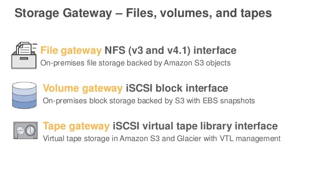

## 3.3 ASG e ALB

Diferença entre Escalabilidade, elasticidade e disponibilidade

- **Escalabilidade**
    - Horizontal
        - Scale out: inicia novas instâncias
        - Scale in: termina novas instâncias
    - Vertical
        - Scale up: melhorar as instâncias

- **Elasticidade**
    
    Capacidade de **dimensionamento**(dimensionar) automaticamente as mudanças conforme a demanda.
    Como se fosse literalmente um elástico.
    
    - Horizontal
        - Capacidade de diminuir(scale-in) ou aumentar (scale-out) automaticamente de acordo com a necessidade
    - Vertical
        - Capacidade de melhorar(scale-up) ou diminuir (scale-down) os recursos de uma instância
- **Disponibilidade**
    
    Capacidade de espalhar os recursos ou servidores(instâncias) em varias zonas de disponibilidade(AZs)
    
    
    

### **Amazon EC2 Auto Scaling**

O **Amazon EC2 Auto Scaling** automatiza o processo de lançamento (escalonamento para fora) e término (escalonamento para dentro) de instâncias Amazon EC2 com base na demanda de tráfego para sua aplicação.

> *O Amazon EC2 Auto Scaling fornece elasticidade e escalabilidade.*
> 

Você cria **coleções** de instâncias EC2, chamadas de grupo Auto Scaling (ASG).

Você pode especificar um **número mínimo**, **desejado** e **máximo** de instâncias em cada ASG.

Por exemplo, o seguinte grupo do Auto Scaling tem um tamanho mínimo de uma (01) instância, uma capacidade desejada de duas (02) instâncias e um tamanho máximo de quatro (04) instâncias.

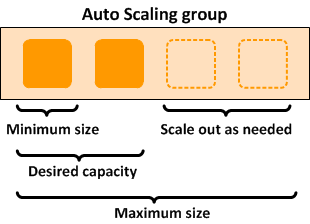

**Políticas de Escalabilidade**

As políticas de escalabilidade que você define ajustam o número de instâncias, dentro dos limites mínimo e máximo de instâncias, com base nos critérios que você especifica.

As políticas de dimensionamento determinam quando, se e como o ASG escala e diminui, usando:

- **Escalonamento dinâmico/on-demand:** Ajusta a quantidade de instâncias em resposta a mudanças na demanda.
- **Escalonamento cíclico/agendado:** Ajusta a quantidade de instâncias em horários específicos, de acordo com um cronograma.

**Planos de Dimensionamento**

Os Planos de Dimensionamento definem os gatilhos e momentos em que as instâncias devem ser provisionadas ou desprovisionadas.

Você pode especificar políticas de dimensionamento que controlam quando o Auto Scaling inicia ou termina instâncias.

### **Amazon Elastic Load Balancing (ELB)**

O Amazon Elastic Load Balancing (ELB) distribui automaticamente o tráfego de aplicativos recebido entre vários destinos, como **instâncias Amazon EC2**, **contêineres** e **endereços IP**.

O ELB pode lidar com a carga variável do tráfego da sua aplicação em **várias Zonas de Disponibilidade**.

Ele também possui alta disponibilidade, dimensionamento automático e segurança robusta necessária para tornar suas aplicações tolerantes a falhas.

> *Existem três tipos de Balanceador de Carga Elástico (ELB) na AWS:*
> 

## 3.4 Serviços de banco de dados na AWS

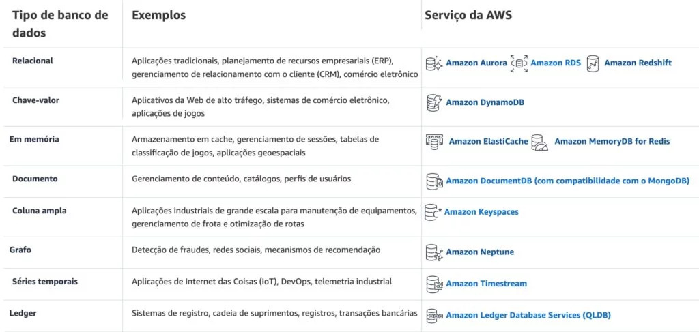

TIPOS DE BANCO DE DADOS!

### **Amazon Relational Database Service (RDS)**

O Amazon Relational Database Service (Amazon RDS) é um **serviço gerenciado** que facilita a configuração, operação e escalabilidade de um banco de dados relacional na nuvem.

> *RDS é um tipo de banco de dados Online Transaction Processing (OLTP).*
> 

> O Amazon RDS é um serviço totalmente gerenciado e você não tem acesso à instância EC2 subjacente (sem acesso ao root).
> 

**Mecanismos de Banco de Dados Suportados no Amazon RDS**

1. IBM db2
2. MySQL
3. PostgreSQL
4. Microsoft SQL Server
5. Oracle
6. MariaDB

O **Amazon Aurora**, apesar de estar sendo demonstrado como **mecanismo** no **Amazon RDS**, ele é um serviço de propriedade AWS, e utiliza seu **próprio mecanismo para gerenciar** um banco de dados relacional MySQL e PostgreSQL.

**O Serviço RDS Inclui:**

- Segurança e atualização das instâncias de banco de dados.
- Backup automático para as instâncias de banco de dados.
- Atualizações de software para o mecanismo de banco de dados.
- Escalonamento fácil para armazenamento e computação.
- **Opção** Multi-AZ com replicação síncrona.
- Failover automático para opção Multi-AZ.
- Horas de instância do banco de dados (horas parciais são cobradas como horas completas).
- Opção de réplicas de leitura para cargas de trabalho de leitura intensiva.
- As réplicas de leitura são usadas para bancos de dados com muitas leituras e a replicação é assíncrona.
- Réplicas de leitura são para compartilhamento de carga de trabalho e alívio de carga.

**Escalabilidade:**

- Você só pode **escalar o RDS para cima** (computação e armazenamento).
- Você não pode **diminuir o armazenamento alocado** para uma instância do RDS.
- Você pode escalar o armazenamento e alterar o tipo de armazenamento para todos os mecanismos de banco de dados, exceto o MS SQL.

### **Amazon ElastiCache**

ElastiCache é um serviço web que facilita a implantação e execução de nós de servidor compatíveis com os protocolos Memcached ou Redis na nuvem.

- Cache em memória que melhora significativamente a latência e o throughput para muitas cargas de trabalho de aplicativos voltadas para leitura ou cargas de trabalho intensivas de computação(ML/IA).
- Melhor para cenários em que a carga do banco de dados é baseada em transações de Processamento Analítico Online (OLAP).
- Os nós EC2 ElastiCache não podem ser acessados pela Internet, nem podem ser acessados por instâncias EC2 em outras VPCs.
- Pode ser em instâncias sob demanda ou reservadas (mas não em instâncias Spot).

| **CASOS DE USO** | **BENEFÍCIOS** |
| --- | --- |
| Armazenamento de Sessão Web | Em casos com servidores web equilibrados, armazene informações de sessão na **Redis**, para que, **se um servidor for perdido**, as **informações da sessão** não sejam perdidas e **outro servidor web possa recuperá-las**. |
| Cache de Banco de Dados | Use o Memcached na frente do AWS RDS para armazenar consultas populares para aliviar o trabalho do RDS e retornar resultados mais rapidamente aos usuários. |
| Quadros de Classificação | Use o Redis para fornecer um quadro de classificação ao vivo para milhões de usuários do seu aplicativo móvel. |
| Dashboards de Dados em Tempo Real | Forneça um local para dados de sensores em tempo real no chão de fábrica, fornecendo displays de painel ao vivo em tempo real. |

**Existem dois tipos de mecanismos do ElastiCache:**

1. **Memcached**: modelo mais simples, pode executar grandes nós com vários núcleos/tarefas, pode ser dimensionado para cima e para baixo, pode armazenar objetos como bancos de dados.
2. **Redis**: modelo mais complexo, suporta criptografia, replicação mestre/escravo, cross-AZ (alta disponibilidade), failover automático e backup/restauração.

## **Amazon DynamoDB**

Amazon DynamoDB é um serviço de banco de dados NoSQL totalmente gerenciado que oferece desempenho rápido e previsível com escalabilidade contínua.

**Características do DynamoDB**

1. Baseado em SSD e usa indexação limitada em atributos para desempenho.
2. Usa HTTP sobre SSL (HTTPS) como transporte e JSON como formato de serialização de mensagem.
3. Armazena três réplicas geograficamente distribuídas de cada tabela para alta disponibilidade e durabilidade de dados.
4. Replicação síncrona em três instalações (AZs) em uma região.
5. Escala armazenamento e throughput para cima ou para baixo conforme necessário sem alterações de código ou tempo de inatividade.

**Fornece dois modelos de leitura:**

- **Leituras eventualmente consistentes (padrão)**:A opção de consistência eventual maximiza seu throughput de leitura (melhor desempenho de leitura).Uma leitura eventualmente consistente **pode não refletir os resultados de uma gravação concluída recentemente**. Consistência em todas as cópias alcançada dentro de 1 segundo.
- **Leituras fortemente consistentes:** Uma leitura fortemente consistente retorna um resultado **que reflete todas as gravações** que receberam uma resposta bem-sucedida antes da leitura (consistência mais rápida).

## Data Analytics Reference/Processo

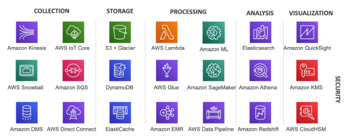

EMR:Amazon Elastic MapReduce
SageMaker: Modelos de ML

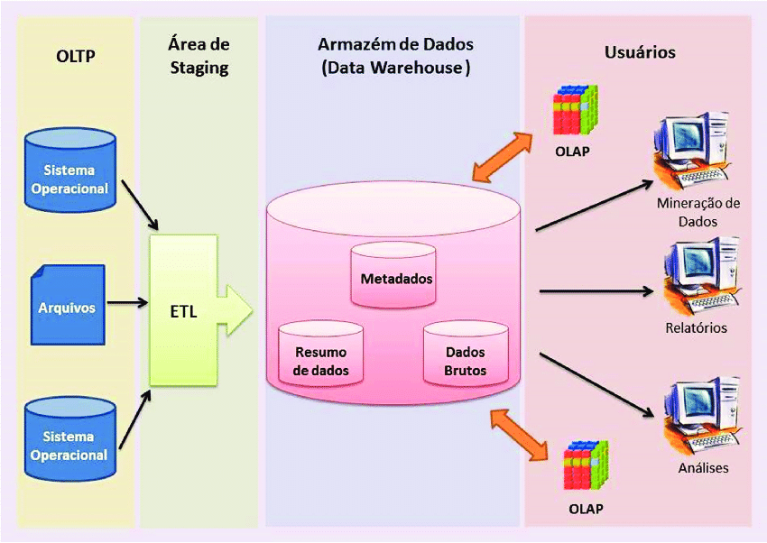

**O OLAP é otimizado para análises e relatórios de dados complexos, enquanto o OLTP é otimizado para processamento transacional e atualizações em tempo real.**

## 3.5 Serviços de rede da AWS

### VPC (Virtual Private Cloud)

Um *Amazon Virtual Private Cloud (VPC)* é uma rede virtual dedicada à sua conta AWS. Ele é logicamente isolado de outras redes virtuais na AWS Cloud.

> *Use como analogia, ter seu próprio data center dentro da AWS.*
> 

O seguinte diagrama mostra uma VPC, que possui uma sub-rede em cada zona de disponibilidade na região, instâncias do EC2 em cada sub-rede e um gateway da Internet para permitir a comunicação **entre os recursos em sua VPC e a Internet:**

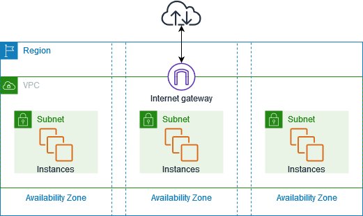

1. Quando você cria sua conta AWS pela primeira vez, uma VPC padrão é criada para você em cada região AWS, com uma sub-rede em cada AZ (zona de disponibilidade).
2. Uma VPC abrange todas as Zonas de Disponibilidade (AZ) na região.
3. Oferece controle total sobre o ambiente de rede virtual, incluindo seleção de intervalos de IP, criação de sub-redes e configuração de tabelas de roteamento e gateways.
4. Você pode **criar seus próprios intervalos de endereços IP** e **criar sub-redes**, **tabelas de roteamento** e **gateways de rede**.

A VPC padrão possui **todas as sub-redes públicas.**

As **sub-redes públicas** são sub-redes que têm:

- “Auto-atribuir endereço IPv4 público” definido como “Sim”.
- A tabela de roteamento da sub-rede tem um Gateway de Internet anexado.

As **instâncias na VPC padrão** sempre têm tanto um endereço IP **público** quanto um endereço IP **privado**.

**Componentes de uma VPC**

- **Virtual Private Cloud:** Uma rede virtual logicamente isolada na AWS. Você define o espaço de endereço IP de uma VPC a partir dos intervalos que você seleciona.
- **Subnet:** Um segmento do intervalo de endereços IP de uma VPC onde você pode colocar grupos de recursos isolados (um para um mapeamento com uma AZ).
- **Internet Gateway:** A parte da Amazon VPC de uma conexão com a Internet pública.
- **NAT Gateway:** Um serviço de Tradução de Endereço de Rede (NAT) gerenciado e altamente disponível para seus recursos em uma sub-rede privada acessarem a Internet.
- **Conexão VPN de hardware:** Uma conexão VPN baseada em hardware entre sua Amazon VPC e seu data center, rede doméstica ou instalação de co-localização.
- **Virtual Private Gateway:** A parte da Amazon VPC de uma conexão VPN.
- **Customer Gateway:** Sua parte de uma conexão VPN.
- **Roteador:** Roteadores interconectam sub-redes e direcionam o tráfego entre Gateways de Internet, Gateways Privados Virtuais, Gateways NAT e sub-redes.
- **Conexão de Interligação:** Uma conexão de interligação permite que você roteie o tráfego via endereços IP privados entre duas VPCs interligadas.
- **Pontos de Extremidade da VPC:** Permitem conectividade privada a serviços hospedados na AWS, de dentro da sua VPC, sem usar um Gateway de Internet, VPN, dispositivos de Tradução de Endereços de Rede (NAT) ou proxies de firewall.
- **Gateway de Internet somente de saída:** Um gateway com estado para fornecer acesso de saída somente para o tráfego IPv6 da VPC para a Internet.

## Resumo VPC

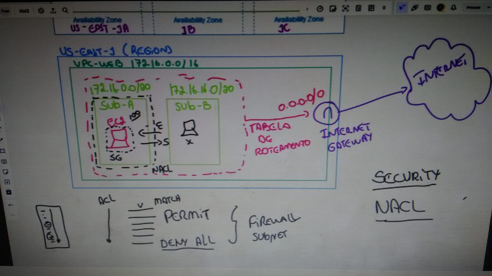

### VPC Endpoint

Existem três tipos de endpoints da VPC: 

- ***endpoints de interface***
- ***endpoints de gateway***
- **endpoints de balanceador de carga de gateway**

Os endpoints de interface e endpoints de balanceador de carga de gateway são desenvolvidos pelo **AWS PrivateLink** e usam uma interface de rede elástica (**ENI**) como ponto de entrada para o tráfego destinado ao serviço. 
Os endpoints de interface normalmente são acessados usando o nome DNS público ou privado associado ao serviço, enquanto os endpoints de gateway e endpoints de balanceador de carga de gateway funcionam como **destino para uma rota na tabela de rotas** para o tráfego destinado ao serviço.

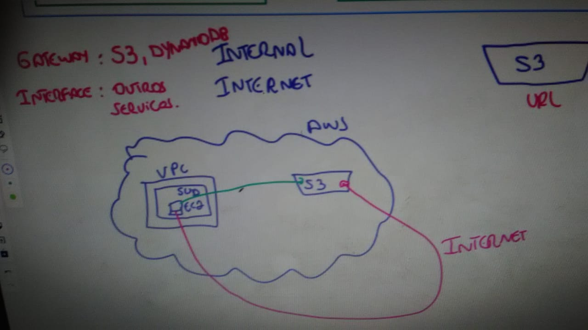
